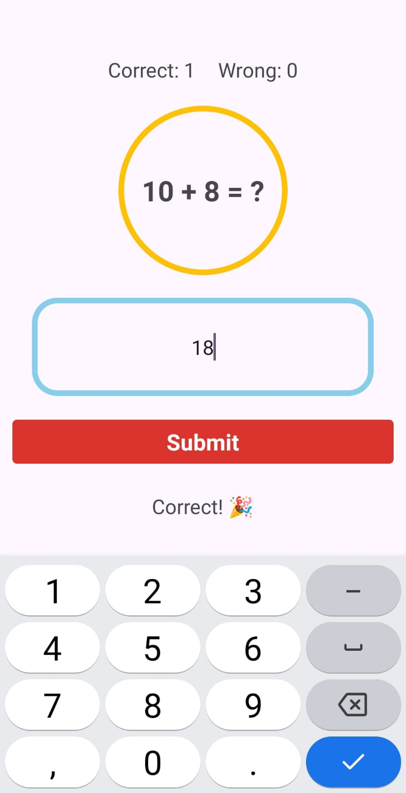
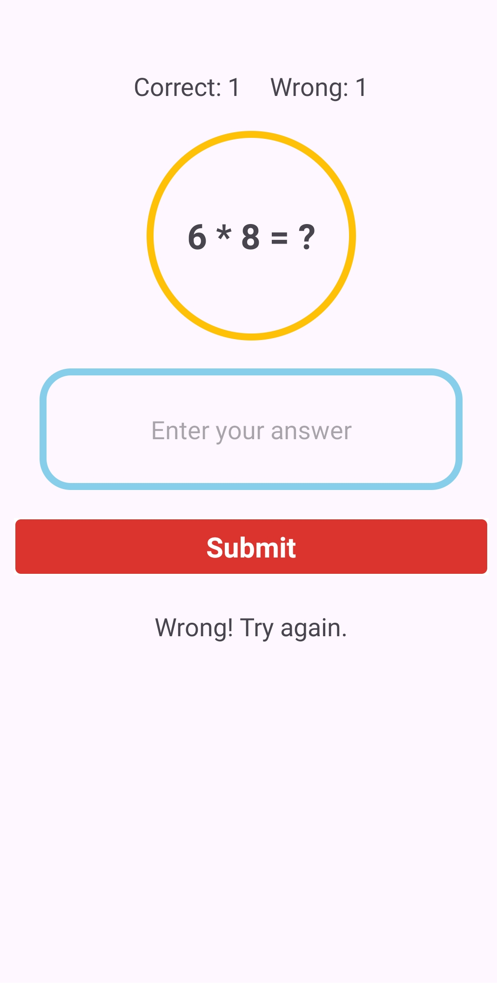
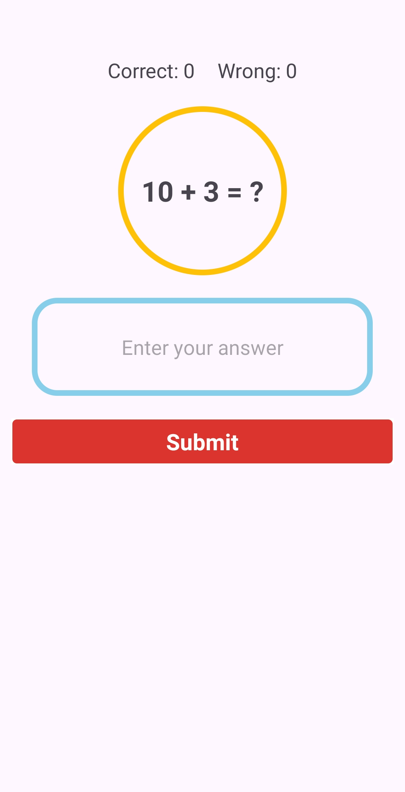

# -Simple-Math-Quiz-App

🧠 Simple Math Quiz App (Android - Java)
A basic Android app built using Java and XML that helps users practice simple addition and multiplication problems. It also keeps track of correct and wrong answers.

-----------------------------------------------------------------------

**📲 Features**

Random math questions (+ or ×)

Score tracking: ✅ Correct / ❌ Wrong

Input answer and submit

Result feedback (Correct / Wrong)

Auto-generate new question after each answer

  

------------------------------------------------------------------

**🛠 Tech Stack**

Language: Java

IDE: Android Studio

Layout: XML with LinearLayout

Min SDK: API 21 (Lollipop) or above

-------------------------------------------------------------------------

**🧑‍💻 Object-Oriented Programming (OOP) Concepts Used**

**Encapsulation:** All variables and methods are organized inside the MainActivity class.

**Abstraction:** Complex tasks like checking answers and generating questions are handled in separate methods (checkAnswer(), generateQuestion(), updateCounts()).

**Modularity:** Logic is broken into clean, reusable functions.

**Class Usage:** MainActivity extends AppCompatActivity, showing class inheritance in action.

-----------------------------------------------------------------------------------------------------

**📁 Files Included**

MainActivity.java – Java class with logic for the app

activity_main.xml – XML layout for UI

-----------------------------------------------------------------------

**🔄 How it Works**

A random question (e.g., 6 + 3 = ? or 7 * 2 = ?) is generated.

User enters an answer in the input field.

On submit:

✅ If correct: "Correct! 🎉" + increment correct score

❌ If wrong: "Wrong! Try again." + increment wrong score

A new question is shown immediately.

-------------------------------------------------------------------------------

**💡 Code Highlights**

Random random = new Random();
num1 = random.nextInt(10) + 1;
num2 = random.nextInt(10) + 1;
correctAnswer = isAddition ? num1 + num2 : num1 * num2;

---------------------------------------------------------------------

**Answer Check Logic:**

if (answer == correctAnswer) {
    tvResult.setText("Correct! 🎉");
    correctAnswers++;
} else {
    tvResult.setText("Wrong! Try again.");
    wrongAnswers++;
}

--------------------------------------------------------------------------------

**🔹 Class Declaration**

public class MainActivity extends AppCompatActivity {

**🔹 Variables Defined**
TextView tvQuestion, tvResult, tvCorrectCount, tvWrongCount;
EditText etAnswer;
LinearLayout btnSubmit;
int num1, num2, correctAnswer;
int correctAnswers = 0;
int wrongAnswers = 0;
String currentOperation;

------------------------------------------
**🔹 onCreate() Method**
This runs when the app starts:

setContentView(R.layout.activity_main) loads the layout XML file that contains your UI design.

tvQuestion = findViewById(R.id.tvQuestion);
etAnswer = findViewById(R.id.etAnswer);
btnSubmit = findViewById(R.id.btnSubmit);
tvResult = findViewById(R.id.tvResult);
tvCorrectCount = findViewById(R.id.tvCorrectCount);
tvWrongCount = findViewById(R.id.tvWrongCount);

---------------------------------------------------------

These lines connect your Java variables to the UI elements in the XML layout.

**generateQuestion();**
Generates the first random question.

btnSubmit.setOnClickListener(new View.OnClickListener() {
    @Override
    public void onClick(View v) {
        checkAnswer();
        hideKeyboard();
    }
});

When the user clicks the submit button:

1. It checks the answer.
2. Hides the keyboard.

------------------------------------------------

**🔹 generateQuestion() Method**

Random random = new Random();
num1 = random.nextInt(10) + 1;
num2 = random.nextInt(10) + 1;
*Creates two random numbers between 1 and 10.

**Randomly decides whether to use addition or multiplication**

if (isAddition) {
    currentOperation = "addition";
    correctAnswer = num1 + num2;
    tvQuestion.setText(num1 + " + " + num2 + " = ?");
} else {
    currentOperation = "multiplication";
    correctAnswer = num1 * num2;
    tvQuestion.setText(num1 + " * " + num2 + " = ?");
}

-----------------------------------------------------------------------------

**🔹 checkAnswer() Method**

String userAnswer = etAnswer.getText().toString();
if (!userAnswer.isEmpty()) {
    int answer = Integer.parseInt(userAnswer);
Takes the input from the user and converts it to an integer.

if (answer == correctAnswer) {
    tvResult.setText("Correct! 🎉");
    correctAnswers++;
} else {
    tvResult.setText("Wrong! Try again.");
    wrongAnswers++;
}

*Compares the user's answer and updates the result text.

*Also increases the correct or wrong answer count.

updateCounts();
generateQuestion();
etAnswer.setText("");

*Updates the correct/wrong counters.
Generates a new question.
Clears the input field for the next answer.

-------------------------------------------------------------------------------------

**🔹 updateCounts() Method**

tvCorrectCount.setText("Correct: " + correctAnswers);
tvWrongCount.setText("Wrong: " + wrongAnswers);

**🔹 hideKeyboard() Method**

InputMethodManager imm = (InputMethodManager) getSystemService(INPUT_METHOD_SERVICE);
if (imm != null && getCurrentFocus() != null) {
    imm.hideSoftInputFromWindow(getCurrentFocus().getWindowToken(), 0);
}

Hides the on-screen keyboard when the submit button is pressed.

**✅ In Short:**
This is a simple math quiz Android app that:

Randomly asks either addition or multiplication questions.

Takes user input, checks if it’s correct or wrong.

Updates the score.

Gives feedback and creates a new question.

         

